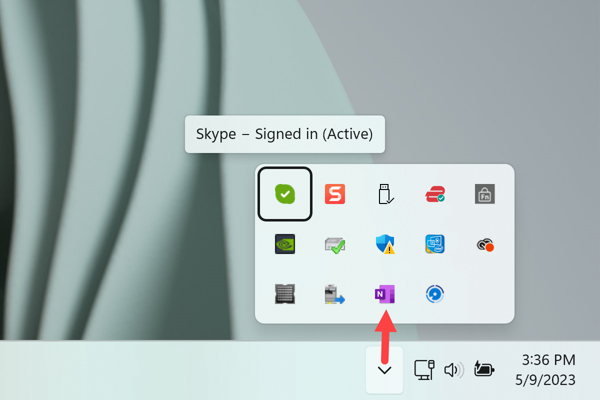

# Posture Guardian

Desktop agent for posture monitoring and ergonomic health.

---

##  Getting Started

Follow these steps to start using **Posture Guardian**:

### 1️⃣ Create an Account
- Go to the official website.
- Register for an account.
- Make sure to securely store your login credentials.

### 2️⃣ Download the Application
- Navigate to the **Download** page.
- Download the Windows application.
- ⚠️ Currently, the app is available for **Windows only**.
- During installation, you may need to grant permissions (see the installation notes on the website for details).

### 3️⃣ Install and Launch
- Install the application.
- After installation, locate the **Posture Guardian** icon.
- Launch the app.

### 4️⃣ Sign In
- Enter your credentials.
- The application will:
  - Activate your device camera.
  - Start monitoring posture.
  - Run in the background as a system tray application.

---

## ⚙️ Managing the Application

The application runs in the Windows system tray.



1. Click the **arrow-up (^) icon** in the Windows taskbar (system tray).
2. Find the **Posture Guardian** icon.
3. Right-click the icon to access options:
   - **Stop Monitoring**
   - **Settings**
   - **Exit**

To fully close the application, click **Exit**.

📊 All accumulated statistics will be available in your account on the website.
## Architecture

- **Desktop Agent** (C++): Lightweight system tray app
- **ML Engine** (Python/FastAPI): Posture classification
- **Backend** (Java/Spring Boot): User data & analytics API
- **Frontend** (React/TypeScript): Dashboard & insights

## Quick Start

### Prerequisites
- Docker & Docker Compose
- Python 3.10+
- Java 21
- Node.js 21+
- CMake 3.20+ (for C++)

### Run All Services
```bash
docker-compose up -d
```

### Individual Setup
See README in each folder:
- [ml-engine/README.md](ml-engine/README.md)
- [backend/README.md](backend/README.md)
- [frontend/README.md](frontend/README.md)
- [desktop-agent/README.md](desktop-agent/README.md)

## Development

```bash
# Start databases
docker-compose up postgres redis -d

# Run services locally (each in separate terminal)
cd ml-engine && poetry run uvicorn main:app --reload
cd backend && mvn spring-boot:run
cd frontend && npm run dev
```

## Tech Stack

- **ML**: MediaPipe, FastAPI, Redis
- **Backend**: Spring Boot 3, PostgreSQL, WebSocket
- **Frontend**: React, TypeScript, Vite, TailwindCSS
- **Desktop**: C++, Qt, OpenCV
- **DevOps**: GitHub Actions, Docker

